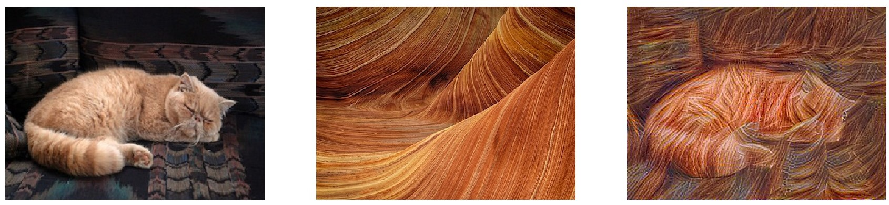
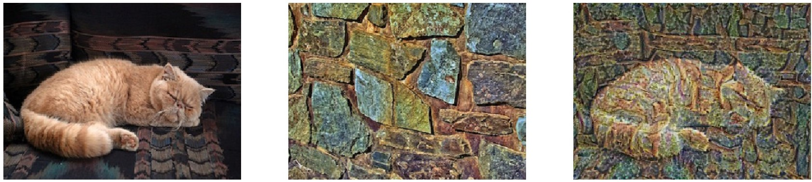
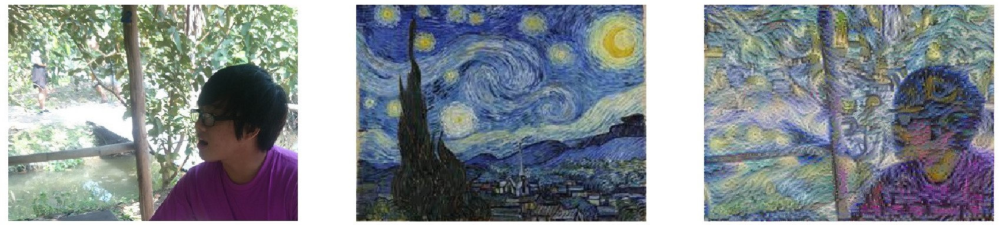
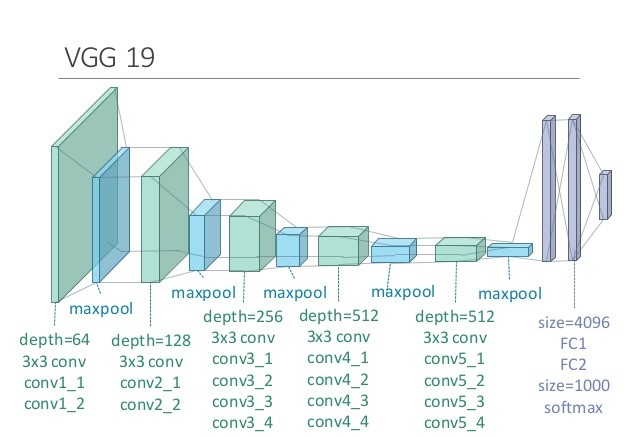

# Artistic Neural Transfer
*This post is my understanding from Coursera's Convolutional Neural Networks course, the implementation is what I've done as 
required assignment, minor modifications added for documenting purpose.*

Artistic Neural Transfer is a very fun part of Deep Learning and has gained a respectable reputation during last several years.
The neural network will receive 2 input images, namely, content image and style image. As the names suggest, its corressponding output
will (hopely) be the content image "redrawn" in the style of style image.

## Examples 

Here are 3 examples of what Artistic Neural Transfer can do. The left and middle image are respectively content and style inputs,
the output is shown on the right image.
 




## How does it work?

Different from other neural networks, an ArtNN does not learn weights/parameters of neurons during its training time. Instead,
it makes use of a pretrained deep ConvNet, feed it 2 input images (content and style) then it will learn the pixel of the output image.

The conv layers are "frozen" at training time and input layer is allowed to change. In order to do this, we would like to define a new
cost function based on Content cost and Style cost.

Before moving on, let's denote content image as C, style image as S and output image as G (generated image)

### Content cost

Content cost is calculated at one layer of the ConvNet. Usually, this layer should be somewhere in the middle of the network (not too deep
or too shallow), let's say we've chosen layer **_i_** to calculate content cost. Then this cost is equal to the sum of square of difference of 
corresponding activation units of layer **_i_** with respect to C and G. Well, if that sounds like alien language, let's look at this formula:

$$J_{content}(C,G) =  \frac{1}{4 \times n_H \times n_W \times n_C}\sum _{ \text{all entries}} (a^{(C)} - a^{(G)})^2 $$

Better right? \(a^{(C)}\) and \(a^{(G)}\) are the activation units of layer **_i_** when the input are C and G respectively.
\(n_{H}\), \(n_{W}\) and \(n_{C}\) are correspondingly height, width and depth (channel) of the layer, they play as normalizing coefficients.

### Style cost

Style cost is a little bit trickier. In order for G to have the same "art style" of S, we make use an idea that if, at layer **_i_**, the correlations of
different channels of that layer filter when input are G and S, respectively, are similar. Let's look at the formula:

$$J_{style}^{[l]}(S,G) = \frac{1}{4 \times {n_C}^2 \times (n_H \times n_W)^2} \sum _{i=1}^{n_C}\sum_{j=1}^{n_C}(G^{M(S)}_{ij} - G^{M(G)}_{ij})^2 $$

\(G^{M}\) is the Gram matrix, I denote it as \(G^{M}\) instead of conventional \(G\) to avoid confusion with input image G. This Gram matrix \(G^{M}\)
calculate the correlation between diffent channels of a filter. The following figure (take from Prof. Andrew Ng's Deep learning Coursera course) does a 
perfect visualization:


Note that \(J_{style}^{[l]}(S,G)\) is caculated on a specific layer **_l_**, since different layers in ConvNet learn different characteristics of the image,
we will want to calculate\(J_{style}^{[l]}(S,G)\) on several different layers, thus what layers to calculate \(J_{style}^{[l]}(S,G)\) is another hyperparameter.  

Also for each value of \(J_{style}^{[l]}(S,G)\) we may want to assign a weight to it, for example, the following code contains Style cost parameters in my implementation, 
first value is the layer name, second value is the weight of that layer style cost:
```python
STYLE_LAYERS = [
    ('conv1_1', 0.125),
    ('conv2_1', 0.125),
    ('conv3_1', 0.125),
    ('conv3_4', 0.125),
    ('conv4_1', 0.125),
    ('conv5_1', 0.125),
    ('conv5_2', 0.125),
    ('conv5_4', 0.125),]
```
Then total Style cost would look like:

$$J_{style}(S,G) = \sum_{l} \lambda^{[l]} J^{[l]}_{style}(S,G)$$
where \(\lambda\) is the weight matrix of Style cost.
### Total cost

With both Content cost and Style cost in hands, the Total cost will just be the weighted sum of those two:
$$J(G) = \alpha J_{content}(C,G) + \beta J_{style}(S,G)$$

## Implementation
With the well-defined cost function, the implementation is pretty straightforward in Python using tensorFlow.

In the implementation, a pretrained VGG19 very deep network is used.


Whole project can be found at: [ArtNeuralTransfer](https://drive.google.com/drive/folders/11OYzjbRf039qtW98Kk78T8vmijo-d-Q7?usp=sharing). You can simply run it by the following command:
```python
python neural-art.py content_image style_image
```

output image can be found in output folder, several example images are included, for example, to generate the first example shown above, the command should be:
```python
python neural-art.py cat.jpg stone.jpg
```
